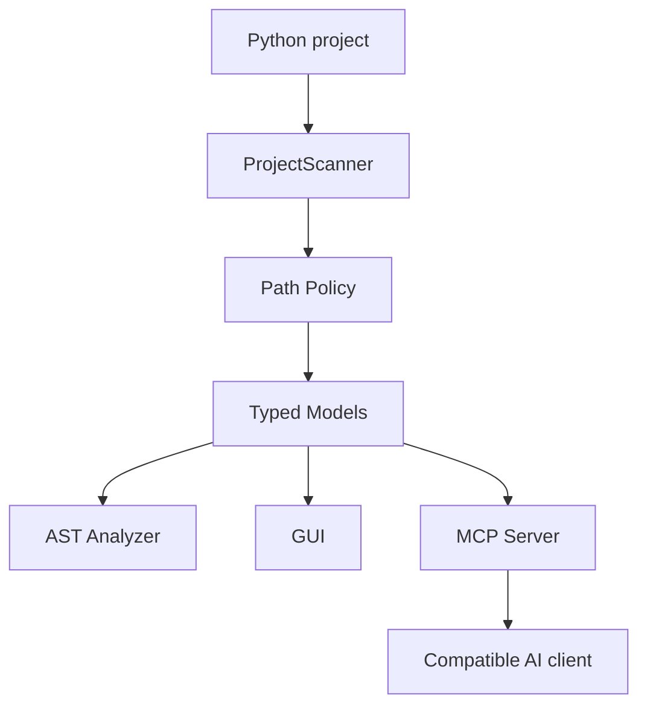

# Architecture

## High-level flow

## Responsibilities

### Scanner

Responsible for filesystem traversal, exclusions, `.gitignore` handling and project-level statistics. It should remain deterministic and independent from the AI layer.

### Path policy

Centralizes access control for filesystem paths exposed through MCP. This prevents each tool from implementing its own traversal checks.

### Models

Provide explicit result structures so consumers do not need to parse terminal output or fragile strings.

### AST analyzer

Uses Python's standard `ast` module to inspect source code structurally. The target file is parsed; it is not imported or executed.

### MCP server

Adapts the deterministic capabilities into tools that can be consumed by MCP-compatible clients. The MCP layer should stay thin and delegate validation and analysis to the domain modules.

### GUI

Provides a human-facing interface without becoming part of the core scanning logic.

## Design principles

1. **Deterministic tools before autonomous behavior.**
2. **Centralized security policy.**
3. **Typed, serializable results.**
4. **No execution of analyzed source code.**
5. **Small adapters around the core domain.**
6. **Tests for security boundaries, not only happy paths.**

## Future evolution

The intended direction is to add bounded file reading and aggregated project intelligence before considering automatic code modification. Any future write capability should have explicit boundaries, validation, tests and a recovery strategy.
